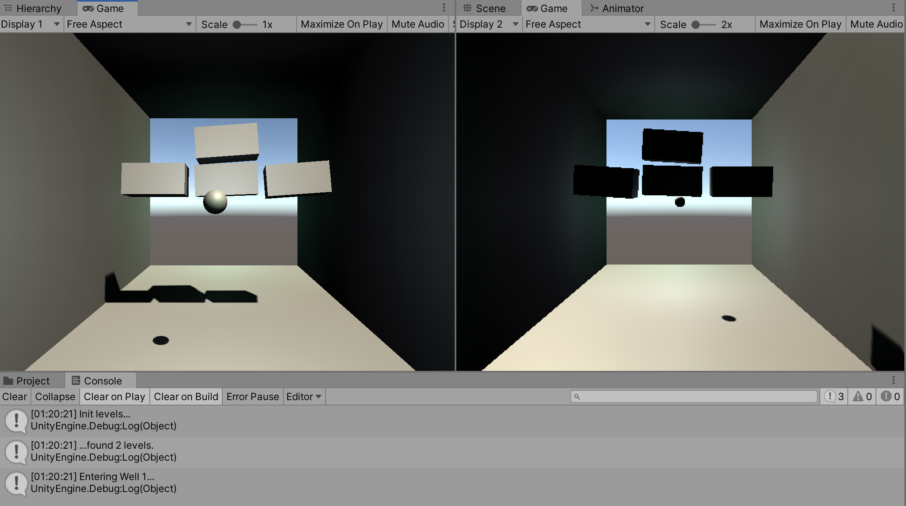

# 3d arkanoid prototype
A two-player 3D arkanoid, written in C# (with UNITY). The game don't use Unity physics, hovewer, it contains rigidbody components to detect collisions.

Since this is a prototype, it will not include models, sounds, textures and so on.

## Requirements
- Unity version: 2019.4.1f1.
- Input System package version: 1.0.0.

## Controls
- `WSAD` - move player 1.
- `Up`, `Down`, `Left`, `Right` - move player 2.
- `Space` - launch ball.

## Concept
### Scene hierarchy
Scene have `Levels` GameObject, that should contain 'levels'. Level name may be random. Level should contain walls (any geometric form) and `Blocks` GameObject. The last one should contain blocks any form with Tag `Block` (that means it can be destructible).
### Game livecycle
After awake, `GameManager` checks scene for levels. Then, it loads the first one (by hiding others and rotating its block randomly), and wires ball to player.

During gameplay, if ball hits block, ball velocity is increasing and its direction mirrored. If player misses the ball, both players lose life. If player destroys all blocks, next level will be loaded.

Both players have inertia.